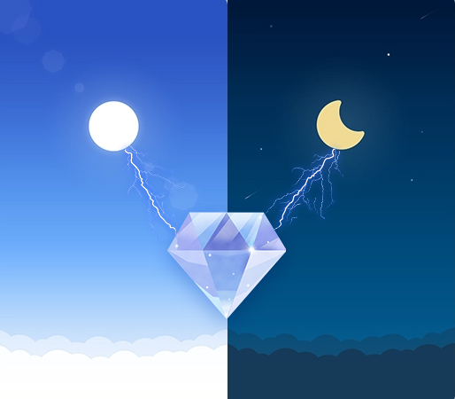

# 介绍

[](http://opensource.org/licenses/MIT)



app-template 是基于 Spring Boot 和 Vue 的快速开发模板

项目采用前后端分离模式，对前后端开发中常用的技术模块进行了整合，并对一些常用功能进行
了实现，主要是为了方便 Web 程序的的开发.

整个项目有三端组成：**后端**，**管理端**，**手机 web 端**，并且打包到一个 **war** 包中方便部署

具体整合的技术有：

* Spring Boot
* Vue
* Mybatis-plus
* Swagger
* Spring security + jwt
* 美团的 [Logan](https://github.com/Meituan-Dianping/Logan)
* Gradle

详细说明请参考 `doc\manual` 下的文档

实现的功能有：

* 开发环境与生成环境的配置切换
* 用户登录登出，并使用 spring boot + jwt 进行授权认证
* 用户权限控制
* 项目运行日志的在线查看与下载
* 项目日志输出级别的动态切换
* 客户端日志的上报、查看与下载
* 前后端国际化处理
* Swagger 在线文档的编辑展示
* 通过 Logan 来获取前端出错日志

## 编译

执行 `./build.sh` 然后根据提示选择编译的版本

编译支持**开发版本**和**生产版本**，两者唯一的区别就是数据库使用的不一样，
开发模式下默认使用的是 **H2** 数据库，生产模式使用的是 **Mysql** 数据库

编译完成后会将整个前端和后端，以及 `deploy` 目录下的素材打包成一个包供发布使用

如果想对前后端分别编译，可以参考下方说明

### 后端编译

使用 **Gradle 5.3** 以上版本来进行编译后端

开发版本编译

```sh
gradle build
```

生产版本编译

```sh
gradle build -Pprod
```

生成的 **war** 包，在 `build/libs` 目录下

### 前端编译

请参考 `web` 目录下各自的 README.md 文件

## 使用

### 初始化数据库

在生产模式下，使用 **Mysql** 之前**必须**创建数据库。

创建好数据库之后，可以通过导入 `deploy\init.sql` 来进行初始化
或者执行安装程序 `install.sh` 来初始化

**注意**: 关于 `install.sh` 的使用说明可以参考 `deploy/README.md`

### 运行

在部署的目录下执行

```sh
./start.sh
```

服务器启动之后，访问网页

* 手机端网页: http://ip:port/app-template/index.html
* 管理端网页: http://ip:port/app-template/admin/index.html
* swagger ui: http://ip:port/app-template/swagger-ui.html

## 其他说明

### 数据库初始化

因为 **H2** 和 **Mysql** 的差异性，所以两者的初始化 sql 脚本不一样

在 `resources/db/` 目录下是 **H2** 数据库初始化使用的

* schema-h2.sql 数据库结构
* data-h2.sql 数据库数据

在 `deploy/init.sql` 是 **Mysql** 数据库初始化使用

### 为什么使用 context-path

`server.servlet.context-path=app-template`, 应用的上下文路径，也可以称为项目路径，
是构成url地址的一部分。

加上该配置后，会自动在 url 前加上 /app-template, 如：原来的接口为
 `localhost:8080/api/user`, 加上该配置后就会
 变成 `localhost:8080/app-template/api/user`

该配置在 ngnix 分发中起作用，主要功能是将所有请求的 url 中包含 `/app-template` 的
请求，分发到指定的 server。

如果不使用 nginx 来进行转发，则可以将该配置删除。
**注意** : 在删除的同时，需要将前端代码中 url 的 **app-template** 也删除。
