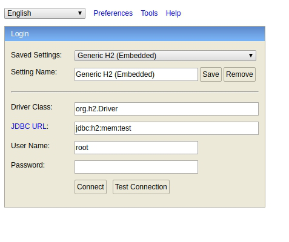
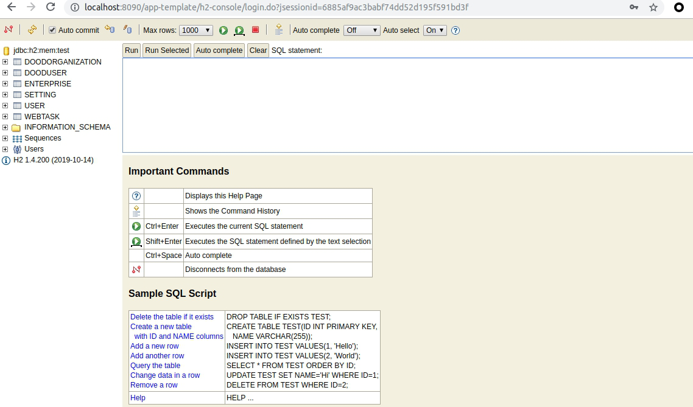

## h2 数据库

在项目中我们将开发环境与生产环境做了一些区分，即我们在开发环境中使用 **h2** 数据库，
在生产环境中使用 **mysql** 数据库.

## 关于 H2

H2 是一款内存数据库，他的主要优点有：

* 速度快, 开源, 支持 JDBC API
* 拥有基于浏览器的控制台应用程序
* 占用空间小, 大约 2MB 的 jar 文件大小

### 项目中的实际使用

在项目中，我们有两个地方会用到 H2 数据库：

1. 开发环境下的数据存储
2. 单元测试

开发环境中使用 H2 数据库是为了代可以直接运行源码，不需要做过多的额外配置;

单元测试使用 H2 数据库，是因为它不需要依赖本地环境，同时可以关闭持久化功能，
每一个用例执行完随即还原到初始状态。

项目中集成 H2 数据库之后，只需要打开 `http:localhost:8090/app-template/h2-console`
链接，就可以访问登录页面

输入用户名密码，就可以查看操作的数据库

