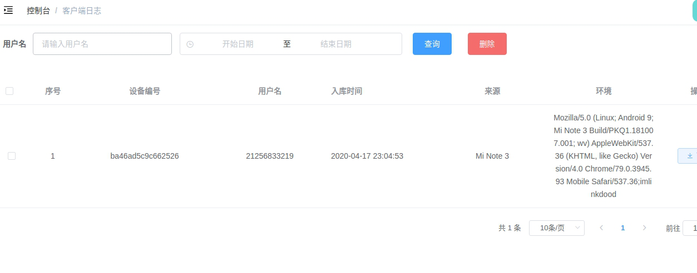

## Logan

### 关于 Logan

[Logan]((https://github.com/Meituan-Dianping/Logan)) 是美团推出的移动端基础日志组件，
该组件主要是进行日志收集、上传、分析的，目前支持 **Android**、**ios** 原生应用，以及 **H5** 应用

我们主要用到该组件 **H5** 应用中相关的日志收集、上传和查看功能。

### 页面

### 后端系统

后端是接收和处理数据中心，相当于Logan的大脑，主要有四个功能：

1. 接收日志
2. 日志解析归档
3. 日志下载

### app 项目

* app 项目对 logan 进行的封装，相关代码在 `common/logan` 目录下，共有三个方法，`logan.log`、`logan.warn`、`logan.error`

* 在项目中要将文本记录到 `logan` 中只要调用 `this.$logan` 即可

* 在 **app** 应用设置页面，有**上传日志**的菜单，点击右侧**上传**按钮就可上传日志

#### 接收日志

客户端日志是由前端主动上报的，可以通过客服引导用户上报，也可以进行预埋，在特定行为发生时进行上报（例如用户投诉）。

#### 日志解析

客户端上报的日志经过加密和压缩处理，后端需要对数据解密、解压还原，继而对数据进行存储存储。

#### 日志下载

数据上传后会存储到数据库中，如果想要查看可以在**客户端日志**页面进行下载查看。