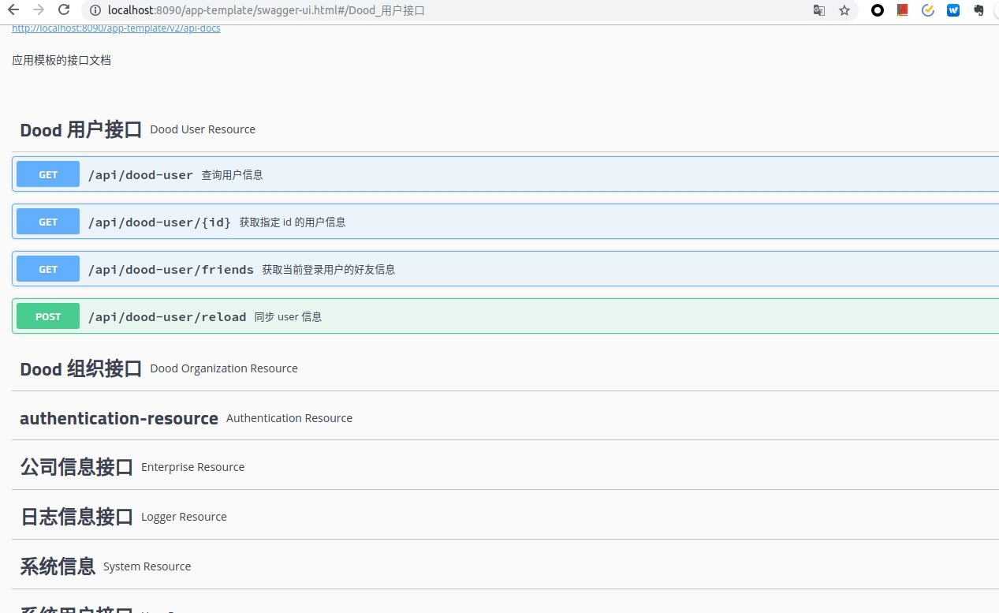

## swagger

Swagger 是一个规范和完整的框架，用于生成、描述、调用和可视化 RESTful 风格的 Web 服务。

### 优点

1. 接口的文档在线自动生成
2. 功能测试

### 使用方式

在代码中每一个接口方法上通过注解来获取用户信息,如图

* @Api : 用在类上，说明该类的主要作用。
* @ApiOperation：用在方法上，给API增加方法说明。
* @ApiImplicitParams : 用在方法上，包含一组参数说明。
* @ApiImplicitParam：用来注解来给方法入参增加说明。
* @ApiResponses：用于表示一组响应。
* @ApiResponse：用在@ApiResponses中，一般用于表达一个错误的响应信息
* @ApiModel：用在返回对象类上，描述一个Model的信息（一般用在请求参数无法使用@ApiImplicitParam注解进行描述的时候）

然后通过访问 url : `http://localhost:8090/app-template/swagger-ui.html` 查看自动生成的接口文档。

