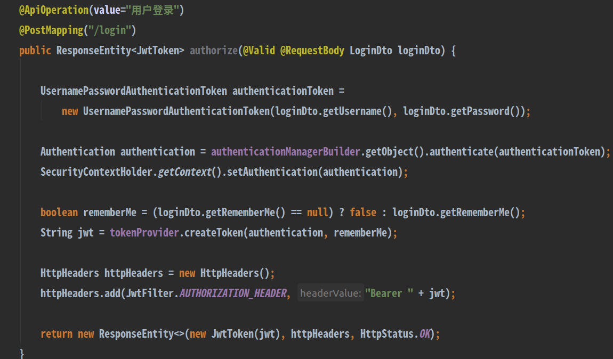
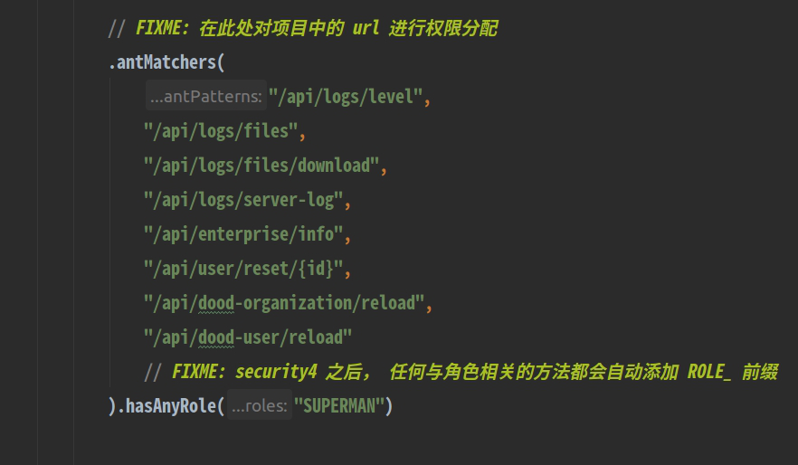

# 介绍

本文介绍了如何通过 **用户名+密码** 的方式来登录和授权，目前程序中是通过
Spring Security + jwt 来实现

## spring security + jwt

SpringSecurity 是企业应用系统的权限管理框架，应用的安全性包括用户认证（Authentication）
和用户授权（Authorization）两个部分。用户认证一般要求用户提供用户名和密码。
系统通过校验用户名和密码来完成认证过程，用户授权指的是验证某个用户是否有权限执行某个操作。
在一个系统中，不同用户所具有的权限是不同的。spring security 的主要核心功能为认证和授权，
所有的架构也是基于这两个核心功能去实现的。

**JSON Web Token** (JWT) 是 JSON 格式的被加密了的字符串。在传统的用户登录认证中，
都是基于 session 的登录认证。用户登录成功，服务端会保存一个session，
当然会给客户端一个 sessionId，客户端会把 sessionId 保存在cookie中，
每次请求都会携带这个 sessionId。

cookie+session 这种模式通常是保存在内存中，而且服务从单服务到多服务会
面临的 session 共享问题，随着用户量的增多，开销就会越大。而 JWT 不是这样的，
只需要服务端生成token，客户端保存这个token，每次请求携带这个token，服务端认证解析。

两者结合，就是使用 JWT 产生的 token 去对校验接口的授权认证。

使用 JWT 认证后，需要有新的用户授权接口，该接口用来验证用户名密码，然后再将用户信息
生成为 **TOKEN** 返回给前端，最后前端通过每一次请求接口时在消息头中带上这个参数，
从而进行授权认证，如：



其中

```java
// 对用户信息做认证授权
authenticationManagerBuilder.getObject().authenticate(authenticationToken);

// 将获取到的用户信息存储 SecurityContextHolder
SecurityContextHolder.getContext().setAuthentication(authentication);

// 将用户信息生成一个 token，返回给前端
tokenProvider.createToken(authentication, rememberMe)
```

在完成授权之后，就可以在 `WebSecurityConfig.java` 中对接口做权限控制



## 登录接口

直接提供一个登录的接口来实现通过用户名和密码的方式来登录，实例代码如下

```java
@RestController
@RequestMapping("/api")
public class AuthenticationResource {
    @ApiOperation(value="用户登录")
    @PostMapping("/login")
    public ResponseEntity<JwtToken> authorize(@Valid @RequestBody LoginDto loginDto) {
        UsernamePasswordAuthenticationToken authenticationToken =
            new UsernamePasswordAuthenticationToken(loginDto.getUsername(), loginDto.getPassword());
        // 对用户信息做认证授权
        Authentication authentication = authenticationManagerBuilder.getObject().authenticate(authenticationToken);
        // 将获取到的用户信息存储 SecurityContextHolder
        SecurityContextHolder.getContext().setAuthentication(authentication);
        boolean rememberMe = (loginDto.getRememberMe() == null) ? false : loginDto.getRememberMe();
        String jwt = tokenProvider.createToken(authentication, rememberMe);
        // 将用户信息生成一个 token
        HttpHeaders httpHeaders = new HttpHeaders();
        httpHeaders.add(JwtFilter.AUTHORIZATION_HEADER, "Bearer " + jwt);
        //返回前端
        return new ResponseEntity<>(new JwtToken(jwt), httpHeaders, HttpStatus.OK);
    }
}
```

在完成授权之后，就可以在 `WebSecurityConfig.java` 中对接口做权限控制


