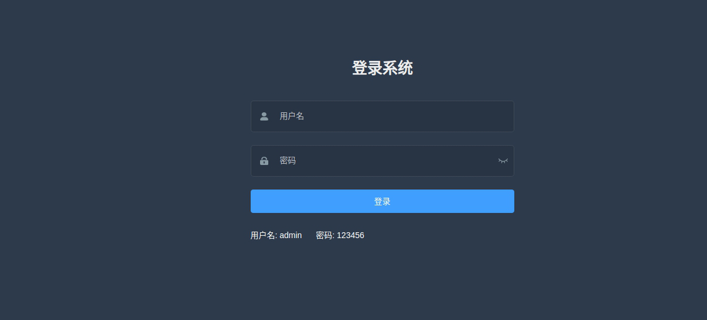
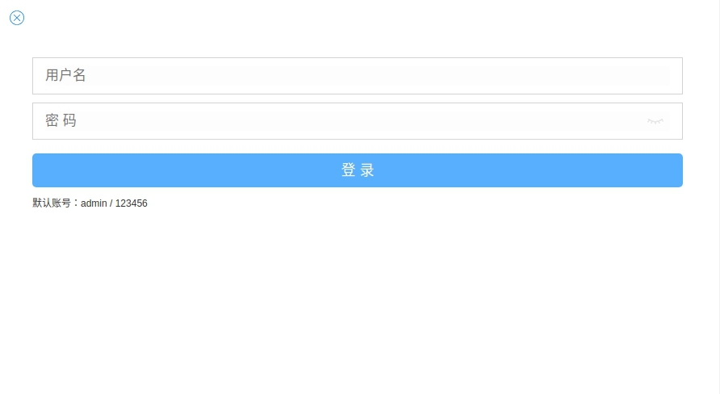

## 项目配置

### 下载

您可以通过 `git clone` 将项目加载到本地

### 环境

在编译运行项目前，需确保您的电脑装备有以下环境:

* java 1.8+
* gradle 5.3+
* npm 6.8.0+

如果您想在 **Intellij IDEA** 中运行项目，请先安装 **lombok** 插件

### 文件目录介绍

* doc - 文档的路径
* deploy - 发布打包的素材路径
* gradle - gradle 配置路径
* src - 后端代码
* web - 前端代码
* build.gradle - gradle 编译文件
* build.sh - Linux 系统下的整体打包脚本
* Jenkinsfile - ci 脚本文件

### build

如果是 **Linux** 系统，可以通过执行 `./build.sh` 项目编译打包，执行后会得
到 **app-deploy.tgz** 安装包，然后可以解压该目录，并通过其中的说明文档，进行项目部署

如果是 **Windows** 系统，则执行 `build.bat` 来进行编译，编译后的素材在 `build/libs` 目录下

手动打包前后端，流程如下：

1. `cd web/app` 目录下, 执行 `npm install` 接着 `npm run build` 编译客户端
2. `cd web/admin` 目录下, 执行 `npm install` 接着 `npm run build:prod` 编译客户端
3. 在项目主目录下创建 `build/www/admin/` 三层目录
4. 将 `web/app/dist/` 目录中的所有文件拷贝到 `build/www` 目录下
5. 将 `web/admin/dist/` 目录中的所有文件拷贝到 `build/www/admin` 目录下
6. 在项目主目录下执行 `gradle build -Pprod`, 然后项目的 war 包会出现在 `build/libs` 目录下

如果在通过 gradle 来进行编译的时候想跳过**单元测试**的步骤可以在命令后
加上 "-x test" 的参数，例如:

```sh
gradle build -Pprod -x test
```

**注意**：为了加速 npm install 的速度，可以使用[淘宝的源](https://developer.aliyun.com/mirror/NPM)

可以在 npm install 之前首先设置 register

```sh
npm config set registry https://registry.npm.taobao.org
```

或者直接使用 **cnpm** 来代替 npm 也可以

### 运行项目

如果您已经打包出了一个 war 包，那您可以通过命令 `java -jar *.war` 来运行项目，项目
运行之后，输入下面的网址来查看到**管理端**页面

```
http://localhost:8090/app-template/admin/imdex.html
```

**注意**: 此处的 **index.html** 是必须的



输入下列网址，可以查看**手机端**页面

```
http://localhost:8090/app-template/imdex.html
```



### 关于 spring 中的 application.yml

项目中配置文件存在三个，分别是 `application.yml`, `applcation-dev.yml`, `application-pro.yml`.

每次程序启动，`application.yml` 文件中的配置始终都会加载的，但是
 `applcation-dev.yml`, `application-pro.yml` 两个文件，
 则是是由 `application.yml` 中的 **spring.profiles.active** 配置来决定
 加载哪个文件的，当该配置为 **pro** 时，会自动加载 `application-pro.yml`;
 当配置为 **dev** 时， 则加载 `application-pro.yml` 文件

将配置文件分为多份，极大的方便了我们的测试，可以将开发环境的配置与生产环境的配置区分开
